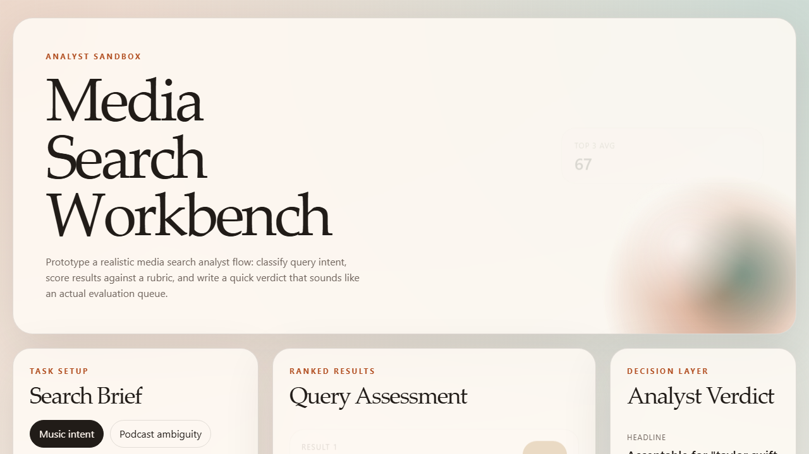

# Media Search Workbench

A small, portfolio-friendly prototype for the kind of vague, judgment-heavy search evaluation work described in media search analyst listings.

Live demo:
[cw4444.github.io/media-search-workbench](https://cw4444.github.io/media-search-workbench/)

GitHub repo:
[cw4444/media-search-workbench](https://github.com/cw4444/media-search-workbench)



## What it is

This project turns a fuzzy job description into something concrete:

- take a messy real-world query
- choose a media domain and market
- score likely results against a consistent relevance rubric
- flag ambiguity and cross-media noise
- export a short analyst-style verdict

Instead of pretending to be a full production pipeline, it focuses on the part that is easiest to demonstrate and easiest to extend later: structured evaluation logic.

## Features

- Analyst presets for apps, music, video, books, podcasts, and home-audio tasks
- Scoring model for exactness, intent, market fit, trend awareness, and trust
- Manual reviewer adjustments to simulate analyst judgment
- Browser-saved assessment history so the tool feels like a real working desk
- Live research jump-offs for web, market, and trend checks
- Secure AI research assist via local OpenAI or Anthropic server calls
- Copy-to-clipboard brief for a quick handoff or portfolio demo
- Responsive interface designed to feel more like an operations desk than a starter template

## Stack

- Vite
- TypeScript
- Plain browser UI with no framework dependency
- GitHub Pages workflow for automatic static deployment
- Optional Vercel deployment for server-side API routes and secure env vars

## Local development

```bash
npm install
npm run dev
```

## Local development with secure API mode

The GitHub Pages demo stays static on purpose, so API keys are never exposed there.

For local AI-backed analyst notes, use environment variables and run both the API server and frontend together:

```bash
npm install
npm run dev:full
```

Supported environment variables:

```bash
OPENAI_API_KEY=...
OPENAI_MODEL=gpt-4o

ANTHROPIC_API_KEY=...
ANTHROPIC_MODEL=claude-sonnet-4-20250514
```

You can also copy [.env.example](.env.example) to `.env.local` if you prefer file-based local envs.

## Hosted deployment with secure env vars

If you want the AI mode to work on a public hosted URL, deploy the repo to Vercel.

This repo now includes:

- [api/analysis.js](api/analysis.js) for AI-backed analyst notes
- [api/health.js](api/health.js) for provider health checks
- [vercel.json](vercel.json) so Vercel builds the Vite frontend and serves the API routes

Set these environment variables in Vercel:

```bash
OPENAI_API_KEY=...
OPENAI_MODEL=gpt-4o

ANTHROPIC_API_KEY=...
ANTHROPIC_MODEL=claude-sonnet-4-20250514
```

Once those are set, the same UI will call `/api/analysis` on your hosted deployment and the AI panel will work without exposing secrets client-side.

## Production build

```bash
npm run build
```

## Why this exists

The original prompt for this repo was basically:

> "This is not a job, it's a hostage situation."

Which, honestly, felt fair.

The listing described search evaluation across apps, music, video, books, podcasts, and home-device contexts, but without saying what a normal day actually looks like. So this repo treats the role as an analyst workflow problem:

1. understand query intent
2. compare likely result types
3. score relevance consistently
4. leave a concise decision trail

That makes it useful as:

- a portfolio piece
- a UI prototype
- a base for plugging in live APIs later

## Next ideas

- Replace seeded candidates with live search or catalog APIs
- Add result snapshots and evidence links per decision
- Store completed assessments locally or in a small backend
- Add side-by-side result comparison for adjudication tasks
